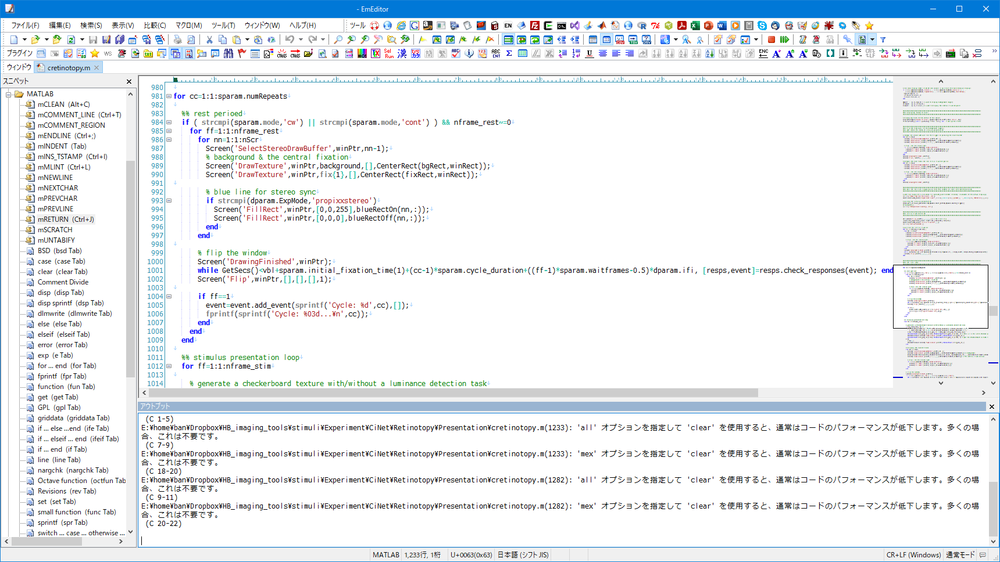
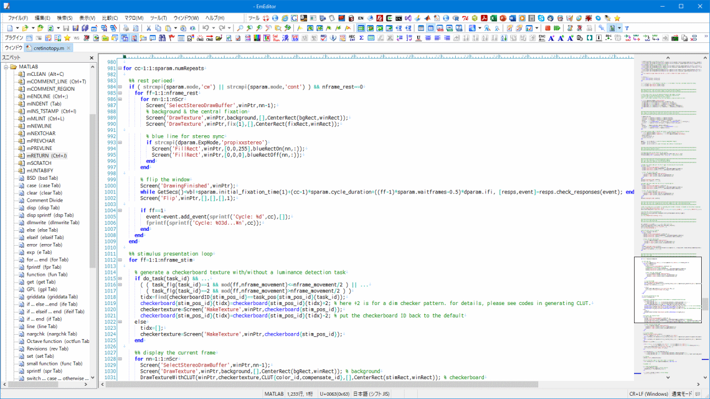
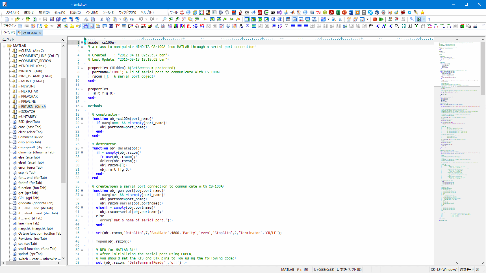

# **README on MATLABtools4EmEditor**

Created    : "2009-01-21 15:08:02 ban" 
Last Update: "2022-06-24 18:00:32 ban"

 

 
 
 

 

# <a name = "Menu"> **MATLABtools4EmEditor -- MATLAB support for EmEditor** </a>

  
MATLABtools4EmEditor provides utilities for MATLAB syntax highlighting, keyword (functions and operators) auto-completion, code snippets, and macros for automations.  

This package contains a set of **EmEditor** syntax-highlighting files, code snippets, and simple JavaScript macros for editing **MATLAB** codes. It enables EmEditor to highlight the MATLAB keywords (functions and operators), detect the grammatical errors/warnings with MATLAB mlint.exe, and support code-editing via semi-auto-completion macros and snippets. I am happy if the tools can help your coding life.  

(EmEditor is a registered trademark of [***Emurasoft, Inc.*** ](https://www.emeditor.com/) )  
(Matlab is a registered trademark of [***The Mathworks Inc.*** ](https://www.mathworks.com/) )  

## **Contents**

  
mMLINT in the snippet/macro enables MATLAB syntax check with mlint.exe in EmEditor.  

  
mINS_TSTAMP in the snippet/macro automatically adds time stamp in saving the *.m files.  

<pre>
matlab_with_toolboxes.esy : EmEditor Syntax File for MATLAB and MATLAB-toolboxes, a full-set version
    This is the EmEditor syntax file for MATLAB and MATLAB toolboxes, which
    supports to highlight keywords (functions and operators). It can be also
    helpful in semi-automatically fill the keywords with the auto-completion
    plugin. Please note that this list currently covers almost all the keywords
    of almost all the MATLAB and the related toolboxes. If some of them are
    not required for you, please delete the irrelevant part(s) from the list.
    Or you can use the light-version of the syntax file below.
    This syntax file has been organized mainly based on MATLAB R2022a.

matlab_with_toolboxes_light.esy : EmEditor Syntax File for MATLAB and MATLAB-toolboxes, a light-weight version
    This is the EmEditor syntax file for MATLAB and MATLAB toolboxes, with
    lesser highlighting keywords, compared to matlab_with_toolboxes.esy.
    If the full-version of the syntax file above is too much, please use
    this light-weight version.
    This syntax file has been organized mainly based on MATLAB R2009a.

EmEditor_MATLAB_snippet.eesnip : EmEditor Snippet File for MATLAB.
    This is the EmEditor snippet file for supporting semiautomatic
    inputs of code snippets. It can now support:
    1. mCLEAN: a Javascript macro snippet,
              cleaning codes by deleting excessive white-spaces.
    2. mCOMMENT_LINE : a Javascript macro snippet,
              commenting a line, made for keyboard manipulations.
    3. mCOMMENT_REGION : a Javascript macro snippet,
              commenting a region, made for keyboard manipulations.
    4. mENDLINE : a Javascript macro snippet,
              adding semicolon in the end of line, made for keyboard manipulations.
    5. mINDENT : a Javascript macro snippet,
              indenting the region, made for keyboard manipulations.
    6. mINS_TSTAMP : a Javascript macro snippet,
              adding time stamp when the phrase, "Last Update : "2022-06-24 18:00:32 ban"
              is detected within the first 200 lines of the source code.
    7. mMLINT : a Javascript macro snippet,
              checking grammatical errors/warnings of the source code
              with mlint.exe. Please change the "mlint" variable in
              this snippet depending on your environment.
    8. mNEWLINE : a Javascript macro snippet,
              moving to the new line, made for keyboard manipulations.
    9. mNEXTCHAR : a Javascript macro snippet,
              moving to the next character, made for keyboard manipulations.
    10. mPREVCHAR : a Javascript macro snippet,
              moving to the previous character, made for keyboard manipulations.
    11. mPREVLINE : a Javascript macro snippet,
              moving to the previous line, made for keyboard manipulations.
    12. mRETURN : a Javascript macro snippet,
              inputting RETURN (ENTER) with semicolon at the end of line.
    13. mSCRATCH : a Javascript macro snippet,
              making a new MATLAB buffer for scratching,
              inspired by an Emacs's macro to open a new elisp scratch buffer.
    14. mUNTABIFY : a Javascript macro snippet,
              un-tabifying the line, made for keyboard manipulations.
    15. The file also covers the MATLAB code snippets listed below.
              BSD, case, clear, Comment Divide, disp, disp sprintf, dlmwrite,
              else, elseif, error, exp, for, fprintf, function, get, GPL,
              griddata, if ... else ... end, if ... elseif ... end,
              if ... end, line, nargchk, Octave function, Revisions,
              set, small function, sprintf, switch ... case ... otherwise ... end,
              switch ... case ... end, title, try ... catch ... end,
              unix, unwind_protect ... cleanup ... end, warning, while,
              xlabel, xtick, ylabel, ytick, zlabel

macros -- directory, which contains JavaScript macros for EmEditor.
    Generally, the macros in this directory are not required if you install
    "EmEditor_MATLAB_snippet.eesnip" since all the macro utilities have been
    already included in the snippet file. When you want to use a part of the
    macro utilities separately, please copy the required one(s) from here to
    EmEditor macro directory.
</pre>

## **License**  

 

MATLABtools4EmEditor -- utilities for editing MATLAB codes with EmEditor. Copyright (c) 2022 Hiroshi Ban. All rights reserved.  

Redistribution and use in source and binary forms, with or without modification, are permitted provided that the following conditions are met:  

    * Redistributions of source code must retain the above copyright
      notice, this list of conditions and the following disclaimer.
    * Redistributions in binary form must reproduce the above copyright
      notice, this list of conditions and the following disclaimer in
      the documentation and/or other materials provided with the distribution

THIS SOFTWARE IS PROVIDED BY THE COPYRIGHT HOLDERS AND CONTRIBUTORS "AS IS" AND ANY EXPRESS OR IMPLIED WARRANTIES, INCLUDING, BUT NOT LIMITED TO, THE IMPLIED WARRANTIES OF MERCHANTABILITY AND FITNESS FOR A PARTICULAR PURPOSE ARE DISCLAIMED. IN NO EVENT SHALL THE COPYRIGHT OWNER OR CONTRIBUTORS BE LIABLE FOR ANY DIRECT, INDIRECT, INCIDENTAL, SPECIAL, EXEMPLARY, OR CONSEQUENTIAL DAMAGES (INCLUDING, BUT NOT LIMITED TO, PROCUREMENT OF SUBSTITUTE GOODS OR SERVICES; LOSS OF USE, DATA, OR PROFITS; OR BUSINESS INTERRUPTION) HOWEVER CAUSED AND ON ANY THEORY OF LIABILITY, WHETHER IN CONTRACT, STRICT LIABILITY, OR TORT (INCLUDING NEGLIGENCE OR OTHERWISE) ARISING IN ANY WAY OUT OF THE USE OF THIS SOFTWARE, EVEN IF ADVISED OF THE POSSIBILITY OF SUCH DAMAGE.  

The views and conclusions contained in the software and documentation are those of the authors and should not be interpreted as representing official policies, either expressed or implied, of the FreeBSD Project.  
